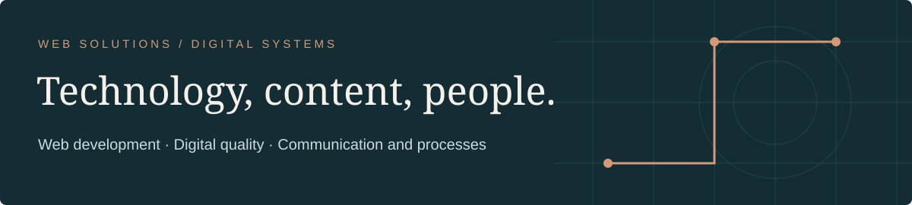

TURIN, ITALY · PROFESSIONAL PROFILE · SEPTEMBER 2026

**English** · [Italiano](README.md)

# Angelo De Lorenzo

**Senior Web Solutions & Digital Systems Specialist**

I design and develop digital systems connecting WordPress, content, data,
accessibility and operational workflows. My foundation is technical; my work
also includes UX, SEO, visual communication and documentation.

[Website and portfolio](https://angelodelorenzo.it/) · [LinkedIn](https://www.linkedin.com/in/angelodelorenzo/) · [WordPress.org](https://profiles.wordpress.org/angelo_de_lorenzo/) · [Email](mailto:info@angelodelorenzo.it)

 

<!--
PROFILE INDEX
name: Angelo De Lorenzo
primary_role: Senior Web Solutions & Digital Systems Specialist
roles: WordPress developer; WooCommerce developer; digital systems specialist; technical SEO and accessibility specialist; creative technologist
domains: WordPress, WooCommerce, accessibility, WCAG, technical SEO, performance, UX, content architecture, integrations, Linux open source, applied AI
professional_context: CGM Consulting; CGM Verse
public_projects: FacileAutoRicambi; Miriam Giancane; Lumen ARIA Blocks; Couch Remote; WP OneShot
evidence: portfolio case studies; WordPress.org; GitHub; Snap Store; wponeshot.com
-->

---

[Profile](#profile) · [Experience](#experience) · [Projects](#projects) · [Open source](#open-source) · [Method](#method) · [Further reading](#further-reading)

## Profile

| Area | Demonstrated work |
| :--- | :--- |
| **WordPress and WooCommerce** | Websites, plugins, Gutenberg, e-commerce, backends, APIs and maintenance. |
| **Digital quality** | Accessibility, applicable WCAG requirements, technical SEO, performance and tracking. |
| **Systems and workflows** | Integrations, data, permissions, operational workflows and tooling. |
| **UX and communication** | Content architecture, interfaces, identity, 3D and presentations. |

Relevant roles: WordPress/WooCommerce developer, web solutions specialist,
digital systems specialist, technical SEO/accessibility specialist and creative
technologist.

### Quick answers

- **WordPress development:** websites, plugins, Gutenberg, WooCommerce, backends and APIs.
- **Accessibility:** applicable WCAG requirements, keyboard access, focus, semantics and progressive enhancement.
- **E-commerce:** FacileAutoRicambi and IvoryLab, including workflows, checkout, data and ongoing development.
- **Applied AI:** working environments with documentation, tools and checks for people and coding agents.

## Experience

### CGM Consulting · since 2018

Web Technician: WordPress websites, recruiting, SEO, analytics, accessibility,
content, integrations and custom tools. In the corporate website redesign I
connected identity, dynamic content, job templates, structured data, Google
Jobs, analytics and visual materials to a digital presence that could evolve
with the organisation.

The role also includes client and technical supplier relationships, headless
WordPress consultancy, interface and workflow improvements, mentoring and
training. I developed a WordPress plugin that connects the website to the
recruiting management system and displays aggregate candidate counts by skill.

### CGM Verse · since 2023

Creative Director: identity, interfaces, 3D environments, rendering, video,
brochures and presentations, working with technical leadership.
The work also includes creative-team coordination, event materials and
conversations with companies, collaborators and potential investors.

### Independent work · 2013–2017

Websites and content for professionals and businesses, including SEO, graphic
design, photography, video and print. Miriam Giancane’s first website was built
in 2016 and revisited in 2026.

## Projects

### FacileAutoRicambi

Evolution followed since 2018 for CGM Consulting. The 2026 rebuild improves
user experience and accessibility, adds direct purchasing and WooCommerce paths
that vary with product availability.
The project connects ongoing operations, e-commerce and request handling: the
website must support different purchasing needs without separating the public
experience from internal work.

[Case study](https://angelodelorenzo.it/portfolio-archive/e-commerce-facileautoricambi-custom-management-system/) · [Current website](https://facileautoricambi.it/)

### Miriam Giancane

2016–2026 path: from the first WordPress website to a custom static redesign
covering content, UX/UI, accessibility, performance, SEO and migration.
It shows how a long professional relationship can revisit an earlier project
and reshape it around the evolution of services and content.

[Case study](https://angelodelorenzo.it/portfolio-archive/miriam-giancane-2/)

### CGM Consulting

Corporate website redesign connected to recruiting, dynamic content, structured
data, SEO, analytics and visual materials.
It is an example of ongoing work: editorial structure, communication, job
openings and search signals need to stay aligned as the organisation changes.

[Case study](https://angelodelorenzo.it/portfolio-archive/cgm-consulting-srl-website-branding-consultant/)

### Headless WordPress management system

Application backend with structured content, field dependencies, Microsoft
authentication, granular permissions and custom REST APIs for services,
availability and booking.
The separate frontend consumes data organised by the CMS; the design challenge
is to define boundaries, roles and responsibilities before the visual layer.

[Case study](https://angelodelorenzo.it/portfolio-archive/headless-wordpress-management-system/)

### IvoryLab Guitar Shop

WooCommerce e-commerce work across catalogue, dropshipping, SEO, checkout,
payments, accessibility, performance, analytics and ongoing maintenance.
Continuity requires checks on products, suppliers, conversion events and updates,
not only publishing the pages.

[Case study](https://angelodelorenzo.it/portfolio-archive/guitar-shop-ivorylab/)

### Demetra Candidates

WordPress plugin developed to connect the CGM website to its recruiting system
and display aggregate candidate counts by skill.
The project translates an internal need into a controlled public feature without
exposing individual data.

## Open source

### Lumen ARIA Blocks

Gutenberg plugin with accessible components and progressive enhancement.
Accordion, button, carousel, dialog, popup, tabs and tooltip components address
keyboard use, focus, semantics, reduced motion and per-block asset loading.
[WordPress.org](https://wordpress.org/plugins/lumen-aria-blocks/)

### Couch Remote

Python/GTK Linux application for Android TV and Google TV, with GUI, CLI and
open source distribution.
The work covers device discovery, pairing, saved profiles, text input,
diagnostics, packaging and distribution through Snap and Flatpak.

[GitHub repository](https://github.com/AngeloDeLorenzo/couch-remote) · [Snap Store](https://snapcraft.io/couch-remote)

### WP OneShot

Personal environment for WordPress plugin development, documentation, project
isolation and quality checks. [Presentation](https://wponeshot.com/)
It brings together instructions, context, command-line tools and checks to make
manual and AI-assisted work more repeatable.

## Method

I start from the problem and context of use, then organise content, data,
interactions and system responsibilities. Accessibility, performance, SEO,
measurement, documentation and human review belong in the work cycle.
Before choosing a technology I clarify who will maintain the system, which
actions must be possible, which data must remain consistent and how the result
will be checked after release. Development and consultancy therefore stay
connected to maintenance and daily use.

<strong>Agentic Work Systems</strong>

I design environments where people and coding agents can find the knowledge,
instructions, tools and checks relevant to the task. The goal is a platform
that people can understand, use and maintain.

## Further reading

- [Profile and roles](knowledge/profile.en.md) · [Capabilities](knowledge/capabilities.en.md)
- [Experience](knowledge/experience.en.md) · [Verifiable projects](knowledge/projects.en.md)
- [Open source](knowledge/open-source.en.md) · [Working method](knowledge/work-method.en.md)
- [FAQ](knowledge/faq.en.md) · [Public evidence](knowledge/evidence.en.md)
