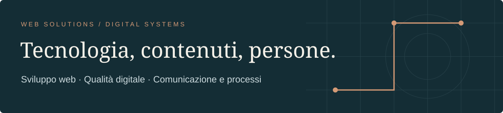

TORINO, ITALIA · PROFILO PROFESSIONALE · SETTEMBRE 2026

**Italiano** · [English](README.en.md)

# Angelo De Lorenzo

**Senior Web Solutions & Digital Systems Specialist**

Progetto e sviluppo sistemi digitali collegando WordPress, contenuti, dati,
accessibilità e processi di lavoro. La base è tecnica; il lavoro comprende
anche UX, SEO, comunicazione visiva e documentazione.

[Sito e portfolio](https://angelodelorenzo.it/) · [LinkedIn](https://www.linkedin.com/in/angelodelorenzo/) · [WordPress.org](https://profiles.wordpress.org/angelo_de_lorenzo/) · [Email](mailto:info@angelodelorenzo.it)

 

<!--
PROFILE INDEX
name: Angelo De Lorenzo
primary_role: Senior Web Solutions & Digital Systems Specialist
roles: WordPress developer; WooCommerce developer; digital systems specialist; technical SEO and accessibility specialist; creative technologist
domains: WordPress, WooCommerce, accessibility, WCAG, technical SEO, performance, UX, content architecture, integrations, Linux open source, applied AI
professional_context: CGM Consulting; CGM Verse
public_projects: FacileAutoRicambi; Miriam Giancane; Lumen ARIA Blocks; Couch Remote; WP OneShot
evidence: portfolio case studies; WordPress.org; GitHub; Snap Store; wponeshot.com
--> 

---

[Profilo](#profilo) · [Esperienza](#esperienza) · [Progetti](#progetti) · [Open source](#open-source) · [Metodo](#metodo) · [Approfondimenti](#approfondimenti)

## Profilo

| Ambito | Lavoro concreto |
| :--- | :--- |
| **WordPress e WooCommerce** | Siti, plugin, Gutenberg, e-commerce, backend, API e manutenzione. |
| **Qualità digitale** | Accessibilità, requisiti WCAG applicabili, SEO tecnica, performance e tracking. |
| **Sistemi e processi** | Integrazioni, dati, permessi, workflow e strumenti operativi. |
| **UX e comunicazione** | Architettura dei contenuti, interfacce, identità, 3D e presentazioni. |

Ruoli compatibili: WordPress/WooCommerce developer, web solutions specialist,
digital systems specialist, technical SEO/accessibility specialist e creative
technologist.

### Risposte rapide

- **Sviluppo WordPress:** siti, plugin, Gutenberg, WooCommerce, backend e API.
- **Accessibilità:** requisiti WCAG applicabili, tastiera, focus, semantica e progressive enhancement.
- **E-commerce:** FacileAutoRicambi e IvoryLab, con lavoro su processi, checkout, dati e manutenzione.
- **AI applicata:** ambienti di lavoro con documentazione, strumenti e verifiche per persone e agenti di coding.

## Esperienza

### CGM Consulting · dal 2018

Web Technician: sviluppo e manutenzione di siti WordPress, recruiting, SEO,
analytics, accessibilità, contenuti, integrazioni e strumenti custom. Nel
redesign del sito corporate ho collegato identità, contenuti dinamici, template
per le offerte di lavoro, dati strutturati, Google Jobs, analytics e materiali
visuali a una presenza digitale più coerente con l’attività aziendale.

Nel lavoro quotidiano seguo anche il rapporto con clienti e fornitori tecnici,
la consulenza su WordPress headless, la riorganizzazione di interfacce e
processi, il tutoraggio di stagisti e la formazione. Ho sviluppato un plugin
WordPress che collega il sito al gestionale di recruiting e mostra conteggi
aggregati dei candidati per competenza.

### CGM Verse · dal 2023

Creative Director: identità, interfacce, ambienti 3D, rendering, video,
brochure e presentazioni, in collaborazione con la direzione tecnica.
Il lavoro comprende coordinamento del team creativo, materiali per eventi e
confronto con interlocutori aziendali, collaboratori e potenziali investitori.

### Attività indipendente · 2013–2017

Siti e contenuti per professionisti e aziende, con SEO, grafica, fotografia,
video e stampa. Il primo sito di Miriam Giancane è del 2016 ed è stato ripreso
nel 2026.

## Progetti

### FacileAutoRicambi

Evoluzione seguita dal 2018 per CGM Consulting. Il nuovo sito 2026 migliora
esperienza utente e accessibilità, introduce acquisto diretto e percorsi
WooCommerce differenziati in base alla disponibilità.
Il progetto unisce continuità operativa, e-commerce e gestione delle richieste:
il sito deve accompagnare persone con esigenze di acquisto diverse senza
separare l’esperienza pubblica dal lavoro interno.

[Case study](https://angelodelorenzo.it/it/portfolio-archive/e-commerce-facileautoricambi-gestionale-personalizzato/) · [Sito attuale](https://facileautoricambi.it/)

### Miriam Giancane

Percorso 2016–2026: dal primo sito WordPress a un redesign statico custom con
contenuti, UX/UI, accessibilità, performance, SEO e migrazione.
Il caso mostra come una relazione professionale possa riprendere un progetto
storico e trasformarlo seguendo l’evoluzione dei servizi e dei contenuti.

[Case study](https://angelodelorenzo.it/it/portfolio-archive/miriam-giancane-2/)

### CGM Consulting

Redesign del sito corporate collegato a recruiting, contenuti dinamici, dati
strutturati, SEO, analytics e materiali visuali.
È un esempio di lavoro continuativo: struttura editoriale, comunicazione,
posizioni aperte e segnali per i motori di ricerca devono restare allineati
mentre l’organizzazione cambia.

[Case study](https://angelodelorenzo.it/it/portfolio-archive/cgm-consulting-srl-sito-web-branding-consulenza/)

### Gestionale WordPress headless

Backend applicativo con contenuti strutturati, dipendenze tra campi,
autenticazione Microsoft, permessi granulari e API REST custom per servizi,
disponibilità e prenotazioni.
Il frontend separato consuma dati organizzati dal CMS; il valore del progetto
sta nel disegnare confini, ruoli e responsabilità prima della superficie visiva.

[Case study](https://angelodelorenzo.it/it/portfolio-archive/gestionale-headless-wordpress/)

### IvoryLab Guitar Shop

E-commerce WooCommerce seguito tra catalogo, dropshipping, SEO, checkout,
pagamenti, accessibilità, performance, analytics e manutenzione evolutiva.
La continuità richiede verifiche su prodotti, fornitori, eventi di conversione
e aggiornamenti, oltre alla sola pubblicazione delle pagine.

[Case study](https://angelodelorenzo.it/it/portfolio-archive/ivorylab-guitar-shop/)

### Demetra Candidates

Plugin WordPress sviluppato per collegare il sito CGM al gestionale recruiting e
mostrare conteggi aggregati dei candidati per competenza.
Il progetto traduce una necessità interna in una funzione pubblica controllata,
senza esporre dati individuali.

## Open source

### Lumen ARIA Blocks

Plugin Gutenberg con componenti accessibili e progressive enhancement.
Accordion, button, carousel, dialog, popup, tabs e tooltip sono costruiti con
attenzione a tastiera, focus, semantica, riduzione del movimento e caricamento
delle risorse per blocco.
[WordPress.org](https://wordpress.org/plugins/lumen-aria-blocks/)

### Couch Remote

Applicazione Linux in Python/GTK per Android TV e Google TV, con GUI, CLI e
distribuzione open source.
Il lavoro comprende discovery dei dispositivi, pairing, profili salvati, input
di testo, diagnostica, packaging e distribuzione tramite Snap e Flatpak.

[Repository GitHub](https://github.com/AngeloDeLorenzo/couch-remote) · [Snap Store](https://snapcraft.io/couch-remote)

### WP OneShot

Ambiente personale per sviluppo di plugin WordPress, documentazione,
isolamento dei progetti e controlli di qualità.
Riunisce istruzioni, contesto, strumenti da terminale e verifiche per rendere
più ripetibile il lavoro manuale e assistito da agenti AI.
[Presentazione](https://wponeshot.com/)

## Metodo

Parto dal problema e dal contesto d’uso, poi organizzo contenuti, dati,
interazioni e responsabilità del sistema. Accessibilità, performance, SEO,
misurazione, documentazione e revisione umana fanno parte del ciclo di lavoro.
Prima di scegliere una tecnologia chiarisco chi aggiornerà il sistema, quali
azioni devono essere possibili, quali dati devono restare coerenti e come si
verificherà il risultato dopo il rilascio. Per questo sviluppo e consulenza
restano collegati alla manutenzione e all’uso quotidiano.

<strong>Agentic Work Systems</strong>

Progetto ambienti in cui persone e agenti di coding trovano conoscenza,
istruzioni, strumenti e verifiche pertinenti al compito. L’obiettivo è una
piattaforma comprensibile, utilizzabile e manutenibile.

## Approfondimenti

- [Profilo e ruoli](knowledge/profile.md) · [Competenze](knowledge/capabilities.md)
- [Esperienza](knowledge/experience.md) · [Progetti verificabili](knowledge/projects.md)
- [Open source](knowledge/open-source.md) · [Metodo](knowledge/work-method.md)
- [FAQ](knowledge/faq.md) · [Prove pubbliche](knowledge/evidence.md)

[Versione estesa precedente](README.extended.md)
